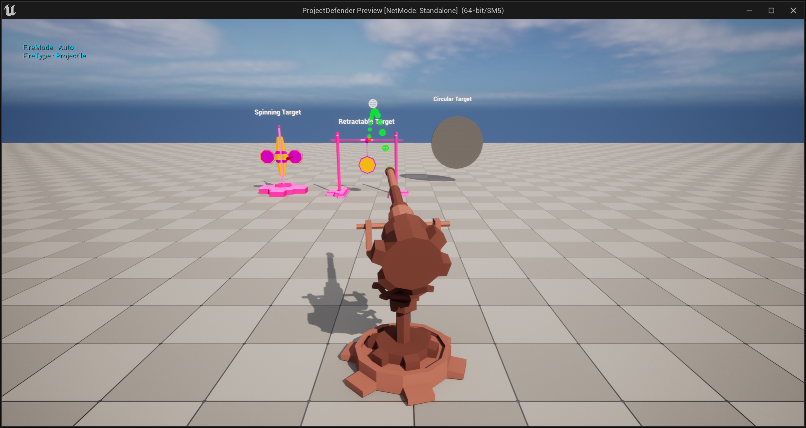
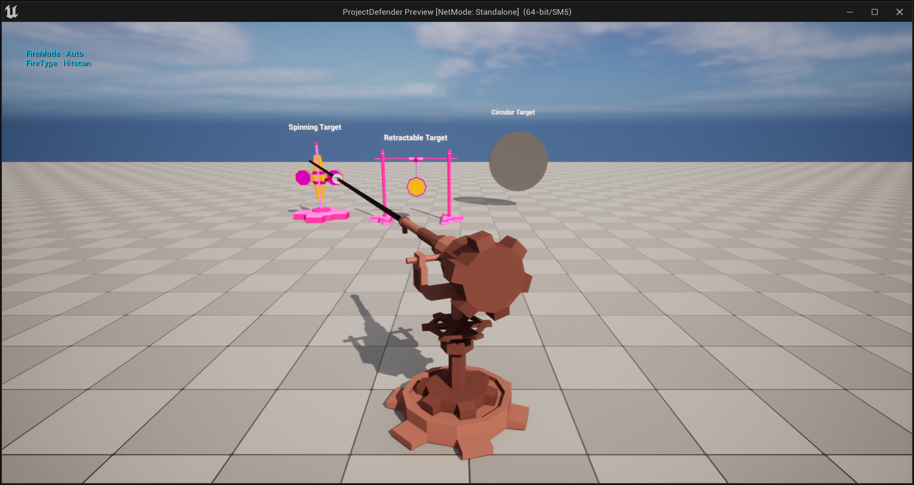

# ProjectDefender

A Recreation of Tower Defence Games with a Twist.

Twist - Single Tower - First Person Controller

## Features

- Fully Mathematical Control of the Tower
- Easy to Control HitScan/Projectile Method of Shooting
- Physics Constraints used to make different types of target.
	- Spinning Target
	- Retractable Target
	- One Shot Destroy

## Screenshots

> Projectile Weapon Hitting Retractable Target

> HitScan Weapon Hitting Spinning Target

## Requirements

- Unreal Engine 5.1
- Visual Studio Community 2022